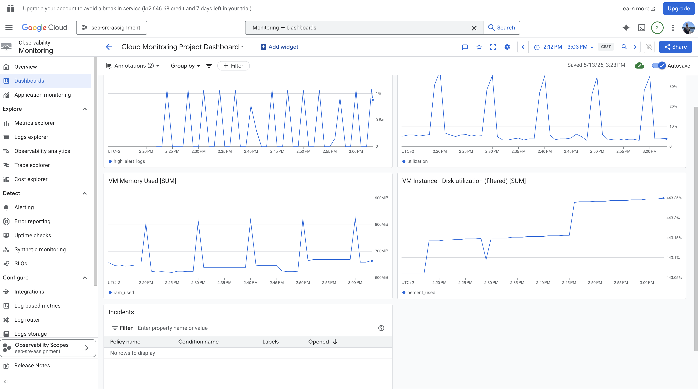

# Cloud Monitoring & Alerting System

A Python-based cloud monitoring application that tracks CPU, memory, and disk usage in real time, generates structured logs, stores alerts, and integrates with Google Cloud Logging, Monitoring, and Alerting for centralized observability.

The application runs:
- locally
- inside Docker
- on a Google Cloud VM as a persistent Linux service using systemd

This project demonstrates practical DevOps, Cloud Engineering, and SRE concepts including monitoring, logging, alerting, cloud deployment, IAM troubleshooting, and dashboard visualization.

---

# Features

- Real-time CPU, memory, and disk monitoring
- Structured JSON log generation
- Local log persistence (`monitor.log`)
- Alert logging (`alerts.log`)
- Multi-alert support (`HIGH CPU`, `HIGH MEMORY`, `HIGH DISK`)
- Dockerized application
- Persistent Docker volume support
- Linux background service using systemd
- Auto-restart and auto-start on boot
- Google Cloud Logging integration
- Google Cloud Monitoring dashboards
- Log-based metrics
- Email alerting policies
- IAM-based logging permissions
- Centralized observability in Google Cloud

---

# Architecture

```text
monitor.py
    ↓
Python logging
    ↓
systemd service
    ↓
Google Cloud Ops Agent
    ↓
Google Cloud Logging
    ↓
Log-based Metrics
    ↓
Alert Policies
    ↓
Email Notifications + Dashboards
```

---

# Dashboard Screenshot



---

# Tech Stack

- Python
- psutil
- Docker
- Google Cloud Platform (Compute Engine)
- Google Cloud Logging
- Google Cloud Monitoring
- Google Cloud Ops Agent
- systemd
- Linux (Ubuntu)

---

# Local Setup

Install dependencies:

```bash
pip install -r requirements.txt
```

Run locally:

```bash
python monitor.py
```

---

# Docker Setup

Build image:

```bash
docker build -t monitoring-app .
```

Run container:

```bash
docker run -v $(pwd):/app monitoring-app
```

---

# Google Cloud VM Deployment

## 1. Enable APIs

Enable:
- Compute Engine API
- Cloud Logging API
- Cloud Monitoring API

---

## 2. Create VM

Recommended configuration:
- Ubuntu LTS
- e2-micro machine type

---

## 3. SSH into VM

Install dependencies:

```bash
sudo apt update
sudo apt install python3-pip git -y
```

Clone repository:

```bash
git clone https://github.com/YOUR_USERNAME/cloud-monitoring-project.git
cd cloud-monitoring-project
```

Install requirements:

```bash
pip3 install -r requirements.txt
```

---

# Google Cloud Logging Integration

The application sends structured logs using Python logging:

```python
logging.info(json.dumps(data))
```

Logs are collected by the Google Cloud Ops Agent and forwarded to Google Cloud Logging automatically.

---

# IAM Configuration (Important)

The VM service account must have:

```text
Logs Writer
```

Otherwise logs will not appear in Google Cloud Logging.

Path:

```text
IAM & Admin → IAM → Service Account → Add Role → Logs Writer
```

---

# Run as a systemd Service

Create service file:

```bash
sudo nano /etc/systemd/system/monitor.service
```

Service configuration:

```ini
[Unit]
Description=Cloud Monitoring Script
After=network.target

[Service]
User=YOUR_USERNAME
WorkingDirectory=/home/YOUR_USERNAME/cloud-monitoring-project
ExecStart=/usr/bin/python3 monitor.py
Restart=always

[Install]
WantedBy=multi-user.target
```

Enable and start service:

```bash
sudo systemctl daemon-reload
sudo systemctl enable monitor
sudo systemctl start monitor
```

Check service status:

```bash
sudo systemctl status monitor
```

View live logs:

```bash
journalctl -u monitor -f
```

---

# Google Cloud Monitoring & Alerting

This project includes:
- Log-based metrics
- Alert policies
- Email notifications
- Monitoring dashboards

Example alert flow:

```text
HIGH MEMORY detected
        ↓
Log written
        ↓
Cloud Logging receives log
        ↓
Log-based metric updated
        ↓
Alert policy triggered
        ↓
Email notification sent
```

---

# View Logs

## Local VM Logs

```bash
tail -f /var/log/monitor.log
```

## systemd Logs

```bash
journalctl -u monitor -f
```

## Google Cloud Logs Explorer

Example query:

```text
resource.type="gce_instance"
jsonPayload.message:"HIGH"
```

---

# Configuration

```python
CPU_THRESHOLD = 80
MEMORY_THRESHOLD = 70
DISK_THRESHOLD = 70
```

---

# Example Output

```json
{
  "timestamp": "2026-05-13 13:05:30",
  "cpu": 12.5,
  "memory": 63.2,
  "disk": 48.1,
  "status": "HIGH MEMORY"
}
```

---

# Project Structure

```text
cloud-monitoring-project/
│
├── monitor.py
├── requirements.txt
├── Dockerfile
├── monitor.log
├── alerts.log
├── README.md
└── screenshots/
    └── dashboards-screenshot.png
```

---

# Key Learning Outcomes

This project demonstrates practical experience with:

- Infrastructure monitoring
- Structured logging
- Cloud observability
- Linux service management
- Docker containerization
- Cloud VM deployment
- IAM troubleshooting
- Centralized log analysis
- Log-based metrics
- Cloud alerting systems
- Monitoring dashboards

---

# Future Improvements

Potential future upgrades:

- Terraform infrastructure deployment
- GitHub Actions CI/CD pipeline
- Kubernetes deployment (GKE)
- Prometheus + Grafana integration
- Slack alert notifications
- Auto-remediation scripts
- Multi-VM monitoring

---

# Purpose

This project was built to practice real-world Cloud Engineering, DevOps, and Site Reliability Engineering (SRE) concepts by deploying a monitoring system from local development to a cloud-based production-style environment.